# DevCycle JS Client SDK - Architecture & API Diagrams

This document provides visual diagrams describing the functionality of each public-facing function in the DevCycle JS Client SDK.

## Table of Contents

1. [Initialization](#initialization)
   - [initializeDevCycle](#initializedevcyclesdkkey-user-options)
   - [onClientInitialized](#onclientinitializedcallback)
2. [Variable Evaluation](#variable-evaluation)
   - [variable](#variablekey-defaultvalue)
   - [variableValue](#variablevaluekey-defaultvalue)
3. [User Management](#user-management)
   - [identifyUser](#identifyuseruser-callback)
   - [resetUser](#resetusercallback)
4. [Data Retrieval](#data-retrieval)
   - [allFeatures](#allfeatures)
   - [allVariables](#allvariables)
5. [Event Tracking](#event-tracking)
   - [track](#trackevent)
   - [flushEvents](#flusheventscallback)
6. [Event Subscription](#event-subscription)
   - [subscribe](#subscribekey-handler)
   - [unsubscribe](#unsubscribekey-handler)
7. [Hooks](#hooks)
   - [addHook](#addhookhook)
   - [clearHooks](#clearhooks)
8. [Lifecycle](#lifecycle)
   - [close](#close)
9. [DVCVariable Class](#dvcvariable-class)
   - [onUpdate](#onupdatecallback)

---

## Initialization

### `initializeDevCycle(sdkKey, user, options)`

Primary function to initialize the DevCycle SDK. Creates and returns a `DevCycleClient` instance that can be used to evaluate feature flags and track events.

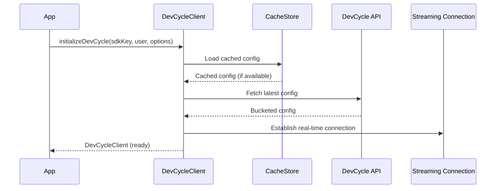

---

### `onClientInitialized(callback?)`

Wait for the SDK to finish initializing. Can be used with either a callback or as a Promise.

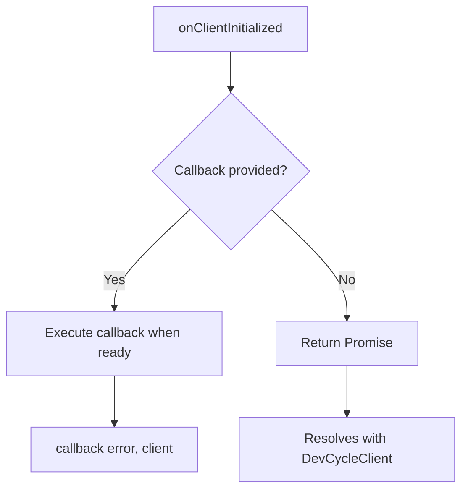

---

## Variable Evaluation

### `variable(key, defaultValue)`

Get a variable object for a feature flag. Returns a `DVCVariable` instance that contains the current value and supports reactive updates via `onUpdate()`.

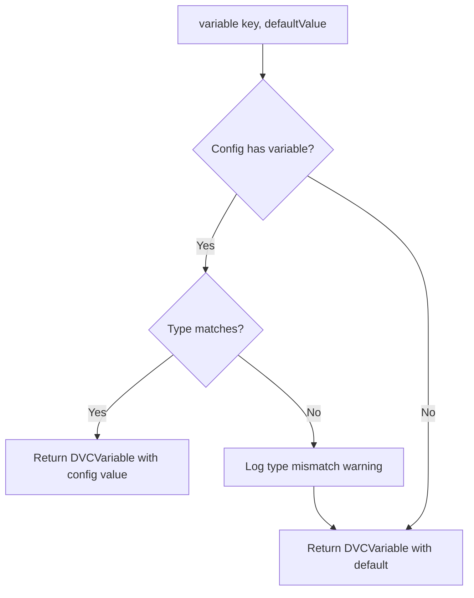

---

### `variableValue(key, defaultValue)`

Get the value of a variable directly. This is a convenience method that calls `variable()` and returns just the value.

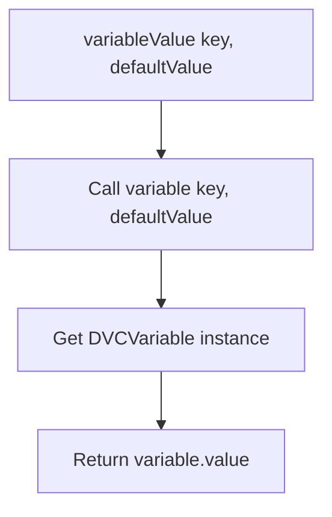

---

## User Management

### `identifyUser(user, callback?)`

Update the current user or identify a new user. This triggers a config refresh from the DevCycle API.

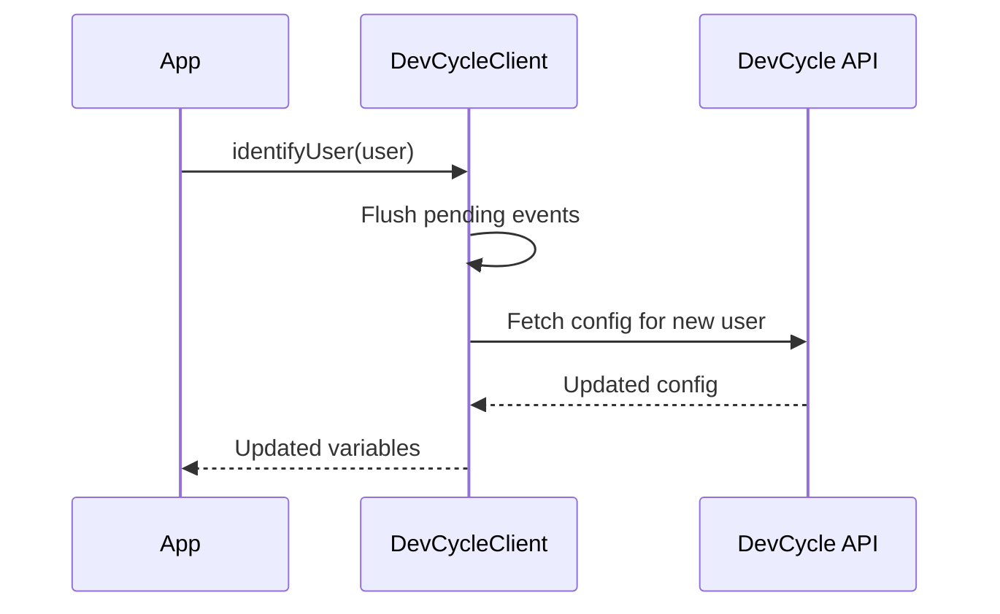

---

### `resetUser(callback?)`

Reset the current user to an anonymous user. Generates a new anonymous ID and fetches fresh config.

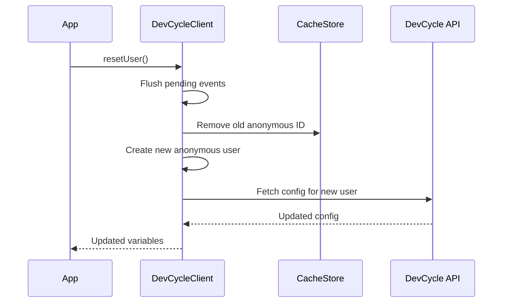

---

## Data Retrieval

### `allFeatures()`

Get all features for the current user. Returns an object mapping feature keys to feature data.

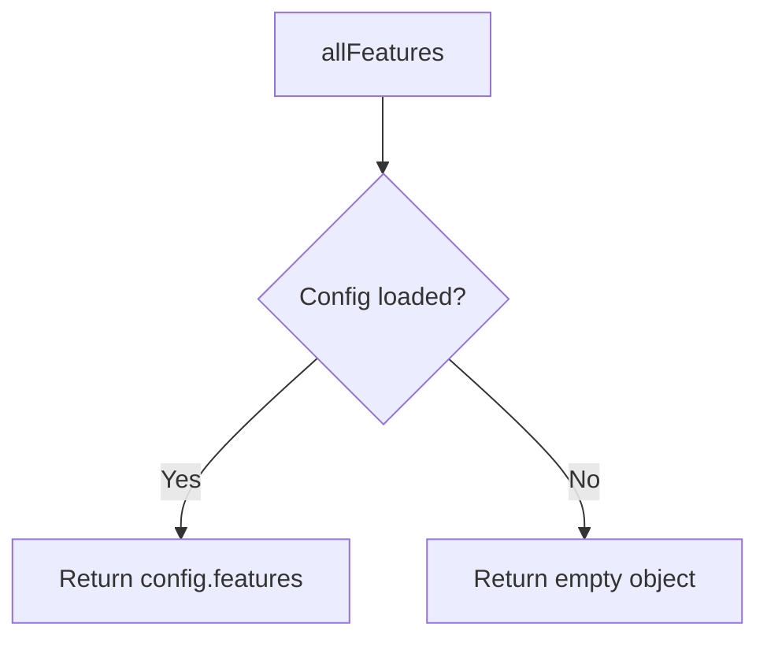

---

### `allVariables()`

Get all variables for the current user. Returns an object mapping variable keys to variable data.

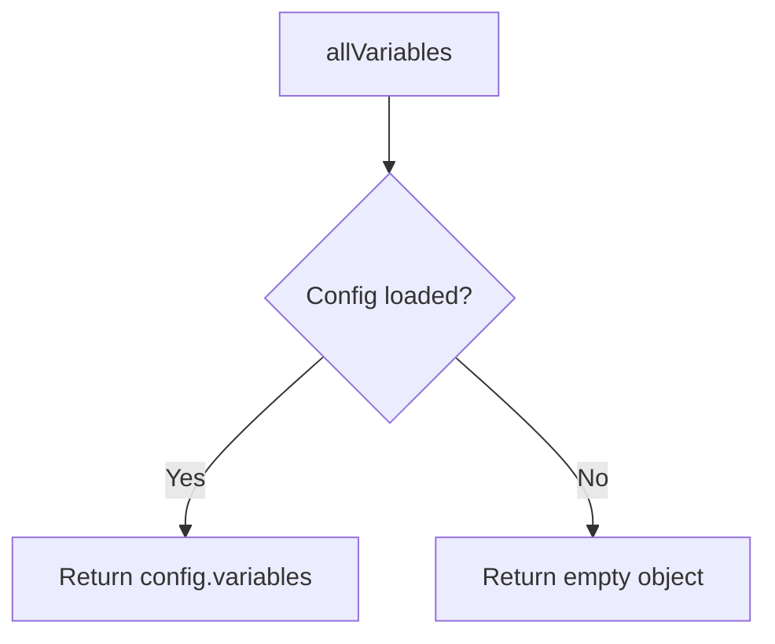

---

## Event Tracking

### `track(event)`

Track a custom event. Events are queued and sent to DevCycle in batches.

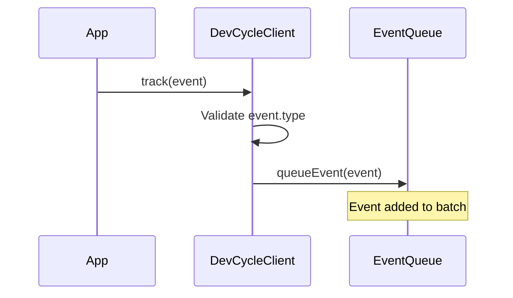

---

### `flushEvents(callback?)`

Manually flush all queued events to DevCycle. Useful before page unload or when immediate delivery is needed.

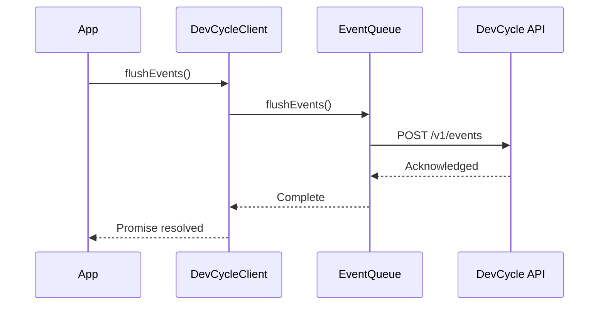

---

## Event Subscription

### `subscribe(key, handler)`

Subscribe to SDK events. The handler is called whenever the specified event is emitted.

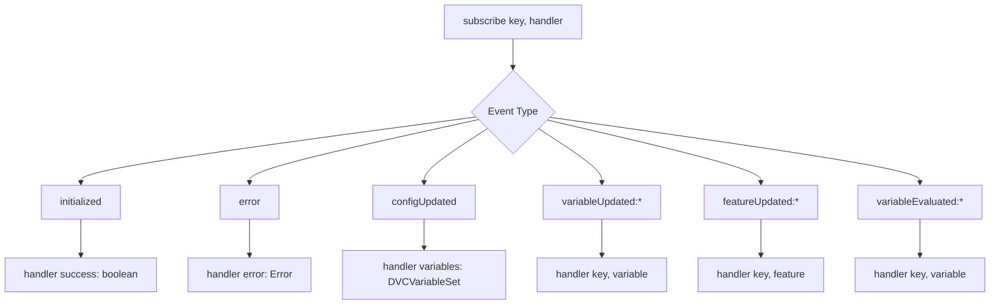

---

### `unsubscribe(key, handler?)`

Remove an event subscription. If no handler is provided, removes all handlers for the given key.

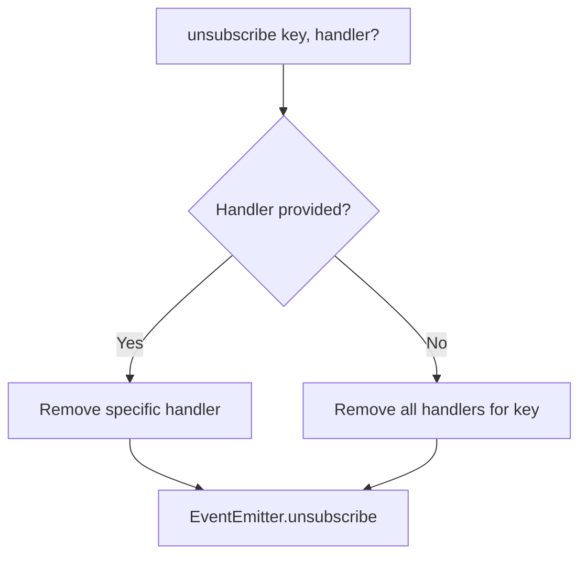

---

## Hooks

### `addHook(hook)`

Add an evaluation hook that runs before and/or after variable evaluations. Hooks can be used for logging, analytics, or custom processing.

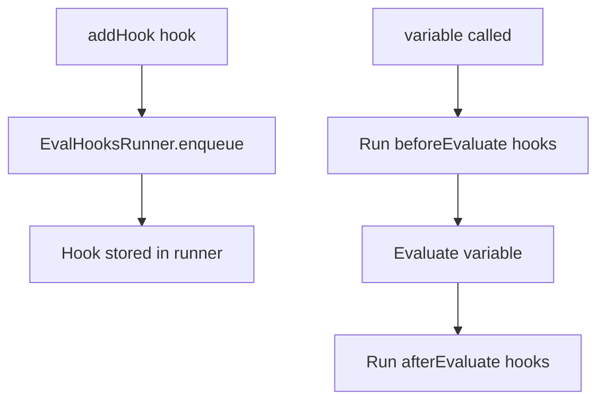

---

### `clearHooks()`

Remove all registered evaluation hooks.

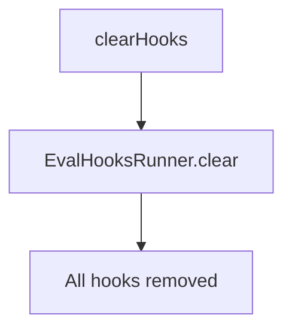

---

## Lifecycle

### `close()`

Close the SDK client. Flushes pending events, closes connections, and removes event listeners. Call this when the client is no longer needed.

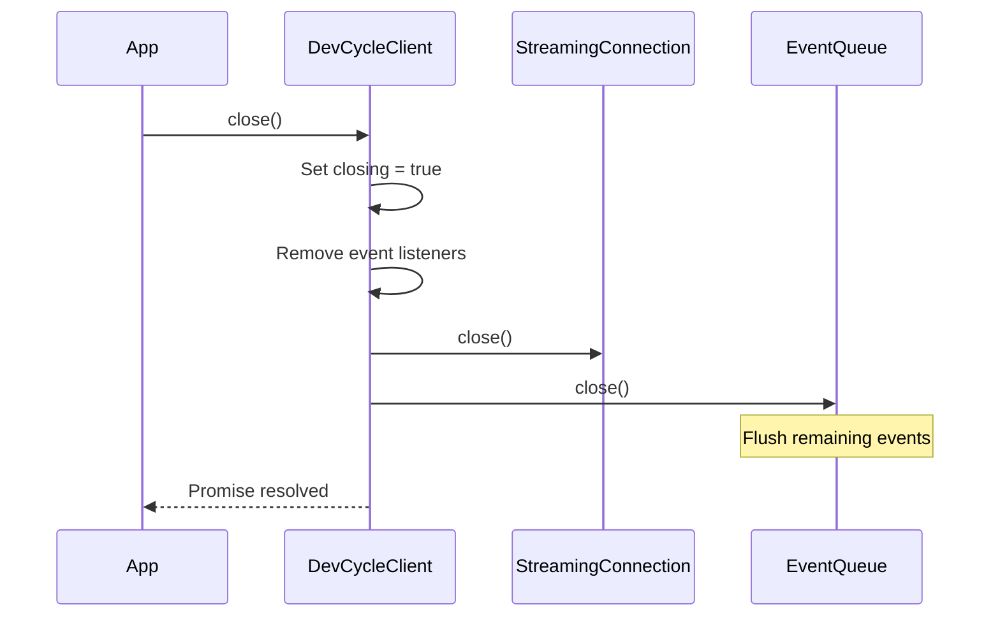

---

## DVCVariable Class

### `onUpdate(callback)`

Register a callback that is called whenever the variable's value changes due to a config update.

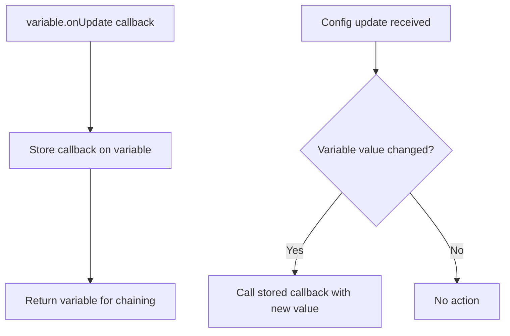

---

## Additional Notes

### Error Handling Summary

| Function | Consumer-Relevant Error Scenarios |
|----------|-----------------------------------|
| `initializeDevCycle` | Invalid SDK key throws `UserError`. Missing user throws `Error`. |
| `identifyUser` | Config fetch failure falls back to cached config if available, otherwise throws. |
| `resetUser` | Config fetch failure rolls back to previous anonymous ID and throws. |
| `variable` | Type mismatch logs warning and returns default value (does not throw). |

### Real-time Updates

The SDK establishes a Server-Sent Events (SSE) connection after initialization to receive real-time config updates. This connection:
- Automatically reconnects when the page becomes visible
- Closes after a period of inactivity when the page is hidden
- Can be disabled via `options.disableRealtimeUpdates`
