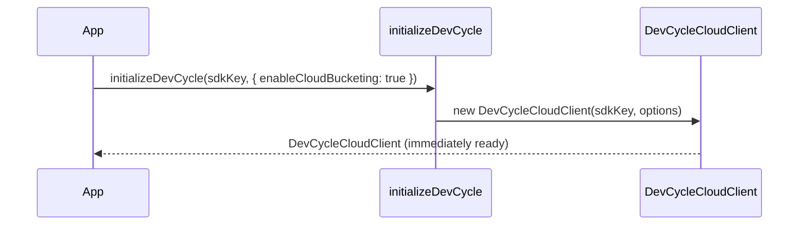
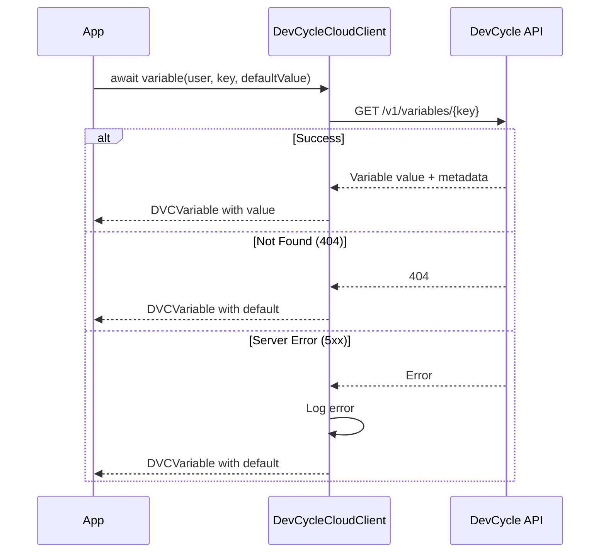
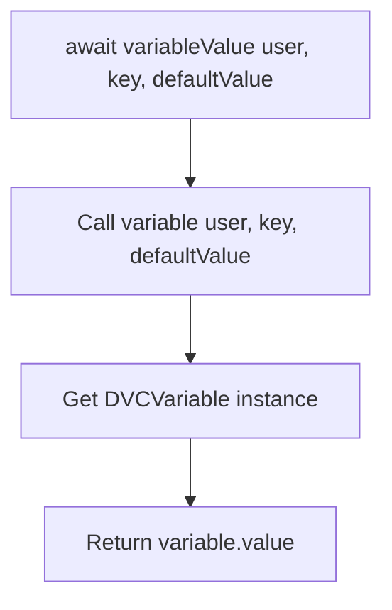
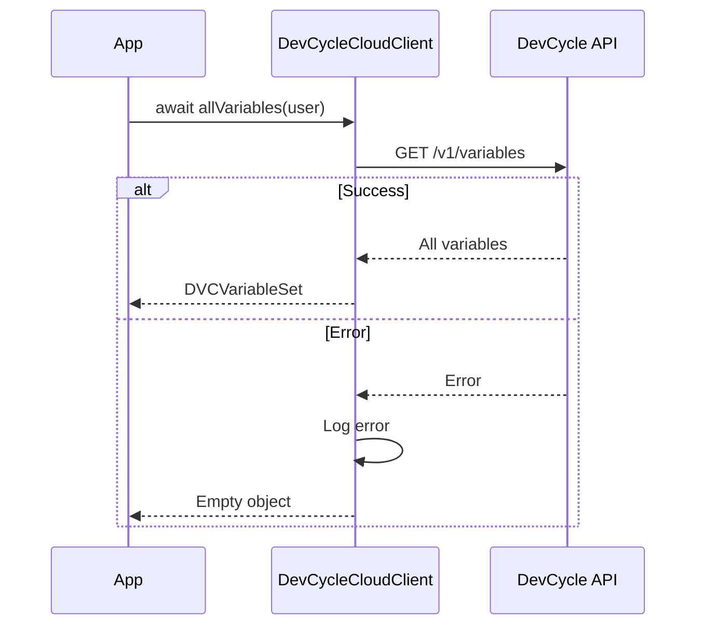
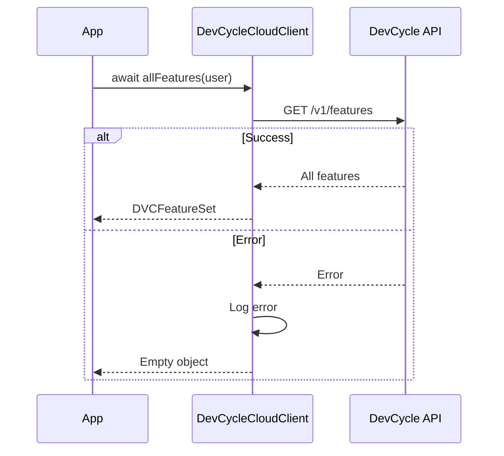
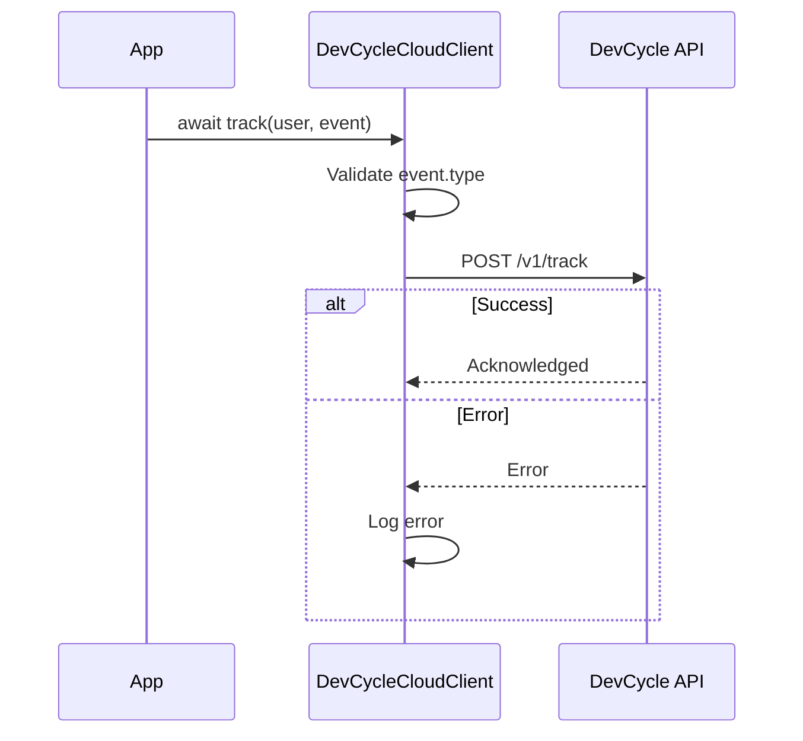
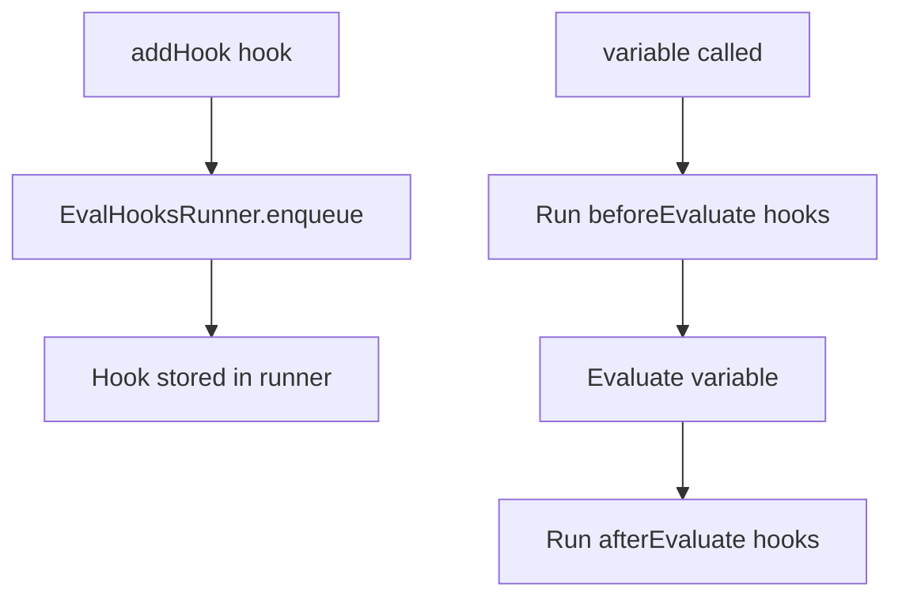
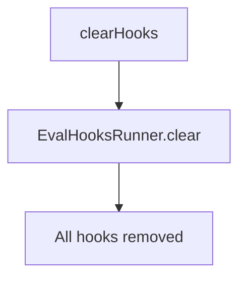

# DevCycle Node.js Server SDK - Architecture & API Diagrams (Cloud Bucketing)

This document provides visual diagrams describing the functionality of each public-facing function in the DevCycle Node.js Server SDK using **Cloud Bucketing** mode.

Cloud Bucketing makes API calls to DevCycle's Bucketing API for each evaluation. All operations are asynchronous. Enable this mode by setting `enableCloudBucketing: true` in initialization options.

For Local Bucketing mode documentation (the default), see [ARCHITECTURE.md](./ARCHITECTURE.md).

## Table of Contents

1. [Initialization](#initialization)
   - [initializeDevCycle](#initializedevcyclesdkkey-options)
2. [Variable Evaluation](#variable-evaluation)
   - [variable](#variableuser-key-defaultvalue)
   - [variableValue](#variablevalueuser-key-defaultvalue)
3. [Data Retrieval](#data-retrieval)
   - [allVariables](#allvariablesuser)
   - [allFeatures](#allfeaturesuser)
4. [Event Tracking](#event-tracking)
   - [track](#trackuser-event)
5. [Hooks](#hooks)
   - [addHook](#addhookhook)
   - [clearHooks](#clearhooks)

---

## Initialization

### `initializeDevCycle(sdkKey, options)`

Creates and returns a `DevCycleCloudClient` for cloud bucketing. The client is immediately ready since all evaluations are done via API calls.

---

## Variable Evaluation

### `variable(user, key, defaultValue)`

Get a variable object for a feature flag. Returns a `DVCVariable` instance containing the value and evaluation metadata. Evaluations are **asynchronous** via API calls.

---

### `variableValue(user, key, defaultValue)`

Get the value of a variable directly. Convenience method that calls `variable()` and returns just the value.

---

## Data Retrieval

### `allVariables(user)`

Get all variables for a user. Returns an object mapping variable keys to variable data.

---

### `allFeatures(user)`

Get all features for a user. Returns an object mapping feature keys to feature data.

---

## Event Tracking

### `track(user, event)`

Track a custom event. Events are sent immediately to the API.

---

## Hooks

### `addHook(hook)`

Add an evaluation hook that runs before and/or after variable evaluations. Hooks can be used for logging, analytics, or custom processing.

---

### `clearHooks()`

Remove all registered evaluation hooks.

---

## Additional Notes

### Comparison with Local Bucketing

| Feature | Cloud Mode | Local Mode |
|---------|------------|------------|
| Initialization | Immediate | Async (fetches config) |
| Variable evaluation | Asynchronous | Synchronous |
| Event tracking | Immediate API call | Batched queue |
| `flushEvents()` | N/A | Available |
| `close()` | N/A | Available |
| `getClientBootstrapConfig()` | N/A | Available |
| `setClientCustomData()` | N/A | Available |
| `clearHooks()` | Available | N/A |
| Offline support | No | Yes (cached config) |

### Error Handling Summary

| Function | Consumer-Relevant Error Scenarios |
|----------|-----------------------------------|
| `initializeDevCycle` | Invalid SDK key throws `Error`. |
| `variable` | Returns default value on API error or type mismatch (does not throw). |
| `allVariables` / `allFeatures` | Returns empty object on API error (does not throw). |
| `track` | Throws on invalid event (missing type). Logs error on API failure. |
