# DevCycle Node.js Server SDK - Architecture & API Diagrams (Local Bucketing)

This document provides visual diagrams describing the functionality of each public-facing function in the DevCycle Node.js Server SDK using **Local Bucketing** mode (the default).

Local Bucketing uses a WebAssembly library to evaluate flags locally. Configuration is fetched from the DevCycle CDN and cached. All evaluations are synchronous.

For Cloud Bucketing mode documentation, see [ARCHITECTURE-CLOUD.md](./ARCHITECTURE-CLOUD.md).

## Table of Contents

1. [Initialization](#initialization)
   - [initializeDevCycle](#initializedevcyclesdkkey-options)
   - [onClientInitialized](#onclientinitializedcallback)
2. [Variable Evaluation](#variable-evaluation)
   - [variable](#variableuser-key-defaultvalue)
   - [variableValue](#variablevalueuser-key-defaultvalue)
3. [Data Retrieval](#data-retrieval)
   - [allVariables](#allvariablesuser)
   - [allFeatures](#allfeaturesuser)
4. [Event Tracking](#event-tracking)
   - [track](#trackuser-event)
   - [flushEvents](#flusheventscallback)
5. [Hooks](#hooks)
   - [addHook](#addhookhook)
6. [Client Bootstrapping](#client-bootstrapping)
   - [getClientBootstrapConfig](#getclientbootstrapconfiguser-useragent)
7. [Custom Data](#custom-data)
   - [setClientCustomData](#setclientcustomdatacustomdata)
8. [Lifecycle](#lifecycle)
   - [close](#close)

---

## Initialization

### `initializeDevCycle(sdkKey, options)`

Creates and returns a `DevCycleClient` for local bucketing. The client initializes asynchronously by fetching configuration from the DevCycle CDN.

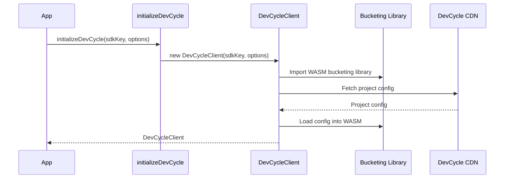

---

### `onClientInitialized(callback?)`

Wait for the SDK to finish initializing. The client fetches configuration from the CDN before it's ready.

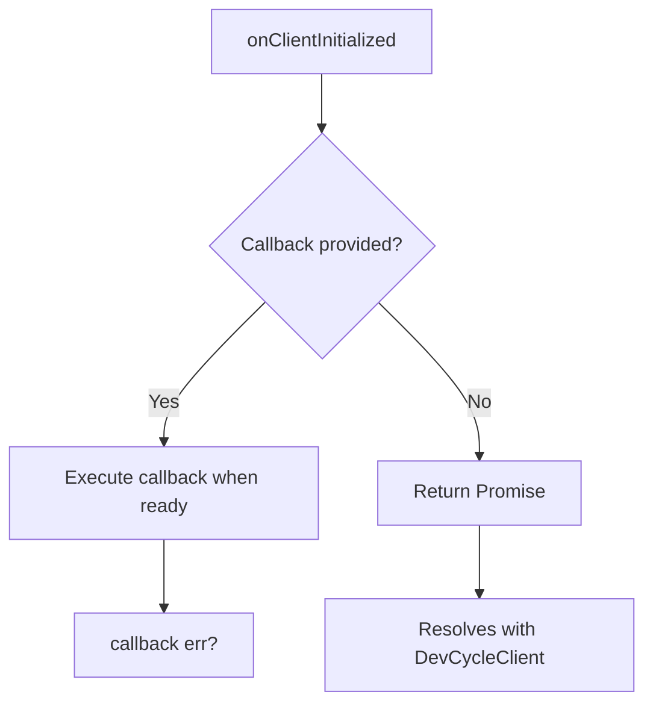

---

## Variable Evaluation

### `variable(user, key, defaultValue)`

Get a variable object for a feature flag. Returns a `DVCVariable` instance containing the value and evaluation metadata. Evaluations are **synchronous** using the WASM bucketing library.

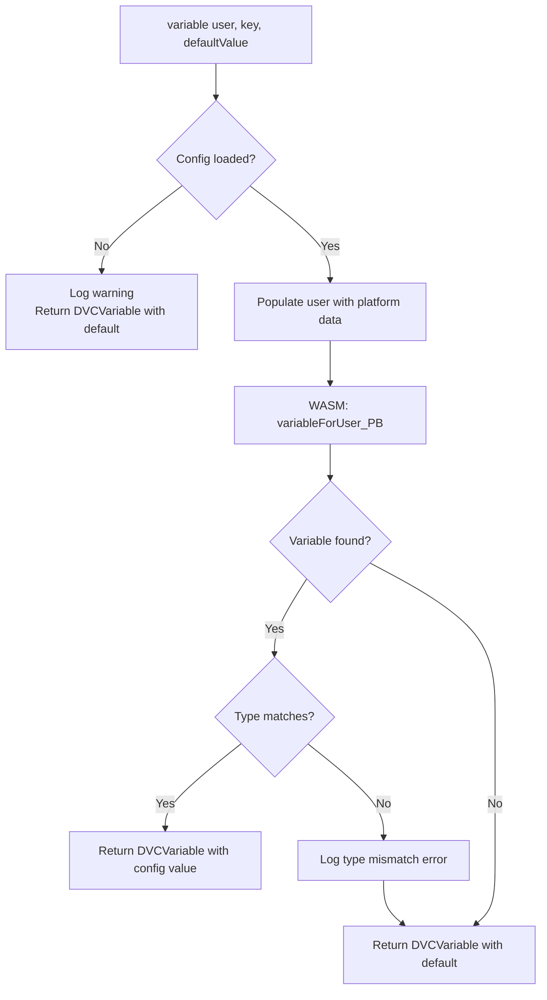

---

### `variableValue(user, key, defaultValue)`

Get the value of a variable directly. Convenience method that calls `variable()` and returns just the value.

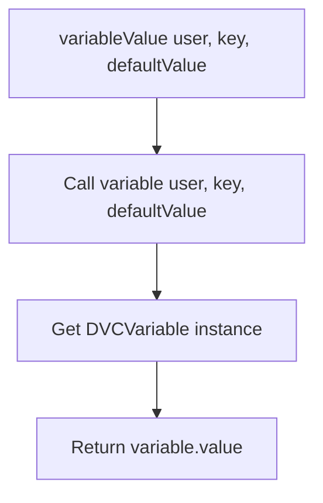

---

## Data Retrieval

### `allVariables(user)`

Get all variables for a user. Returns an object mapping variable keys to variable data.

---

### `allFeatures(user)`

Get all features for a user. Returns an object mapping feature keys to feature data.

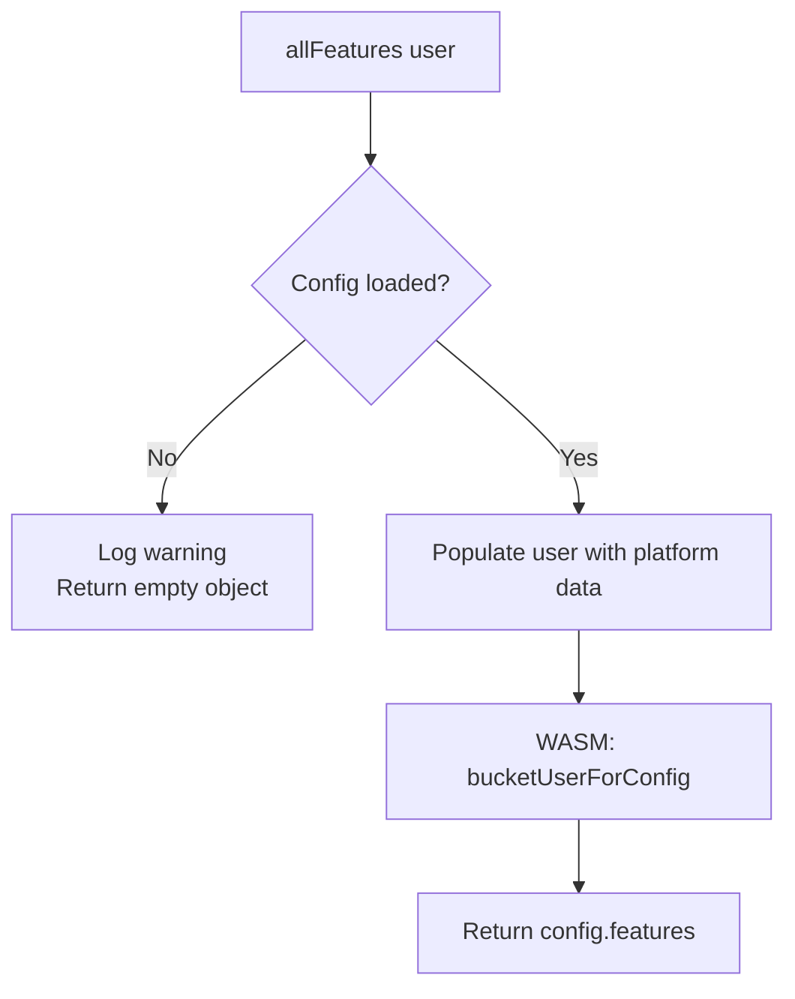

---

## Event Tracking

### `track(user, event)`

Track a custom event. Events are queued and batched for efficient delivery.

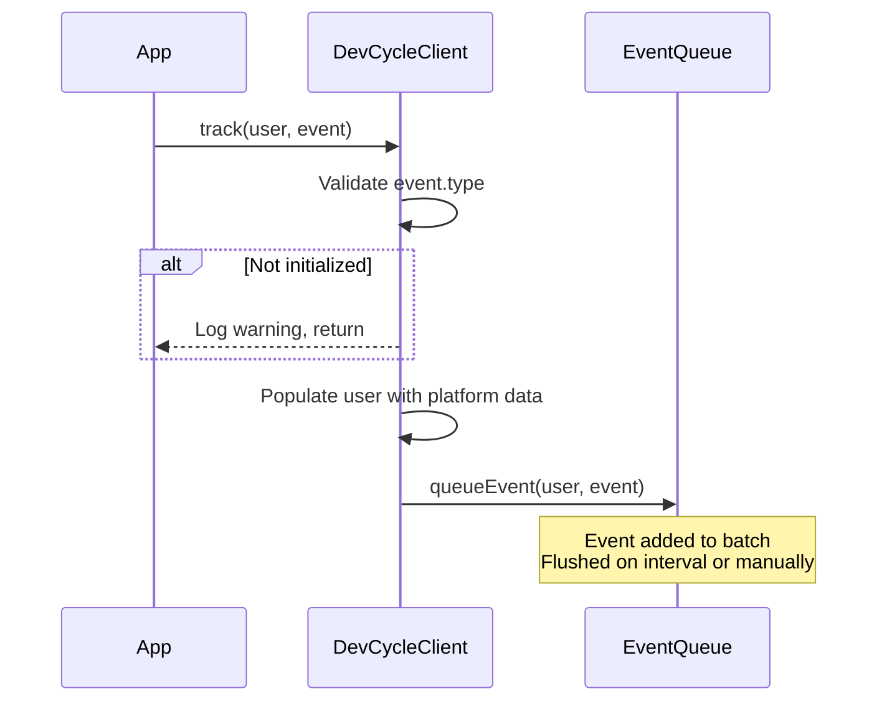

---

### `flushEvents(callback?)`

Manually flush all queued events to DevCycle. Useful before process exit or when immediate delivery is needed.

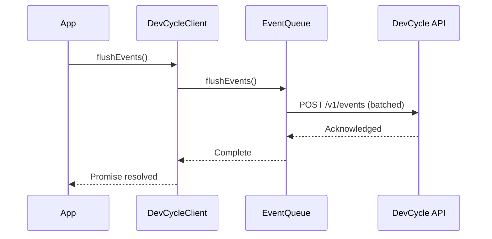

---

## Hooks

### `addHook(hook)`

Add an evaluation hook that runs before and/or after variable evaluations. Hooks can be used for logging, analytics, or custom processing.

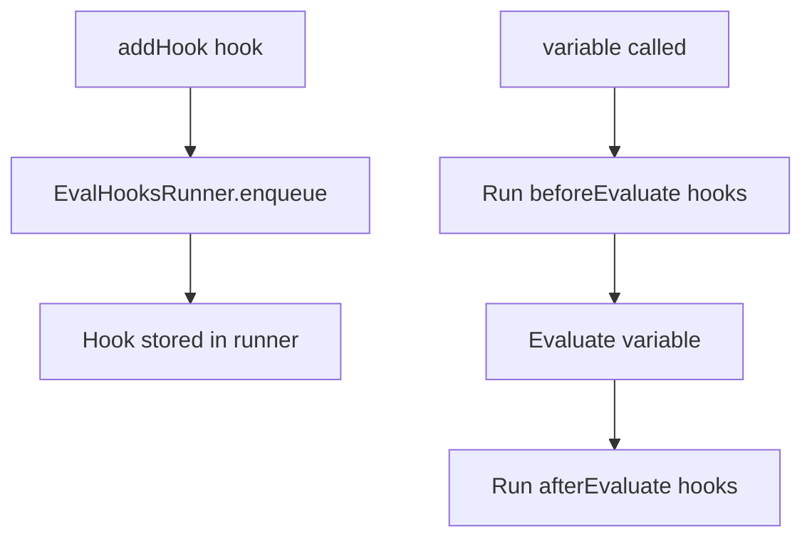

---

## Client Bootstrapping

### `getClientBootstrapConfig(user, userAgent)`

Generate a configuration object suitable for bootstrapping a client-side SDK. This enables server-side rendering scenarios where the server provides initial flag values to the client.

Requires `enableClientBootstrapping: true` in initialization options.

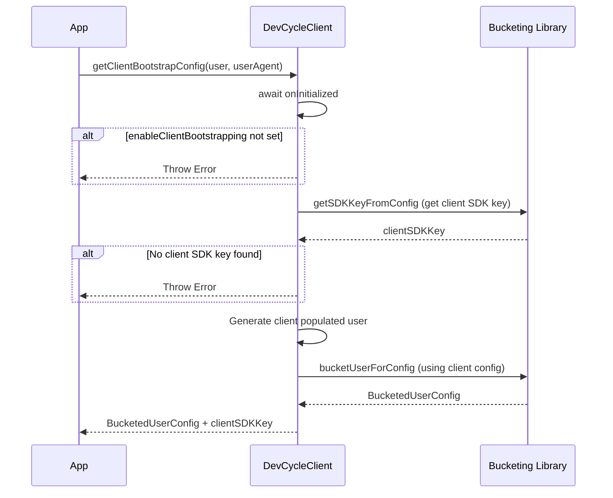

---

## Custom Data

### `setClientCustomData(customData)`

Set custom data that will be used for all subsequent bucketing operations. Useful for setting global context that applies to all users.

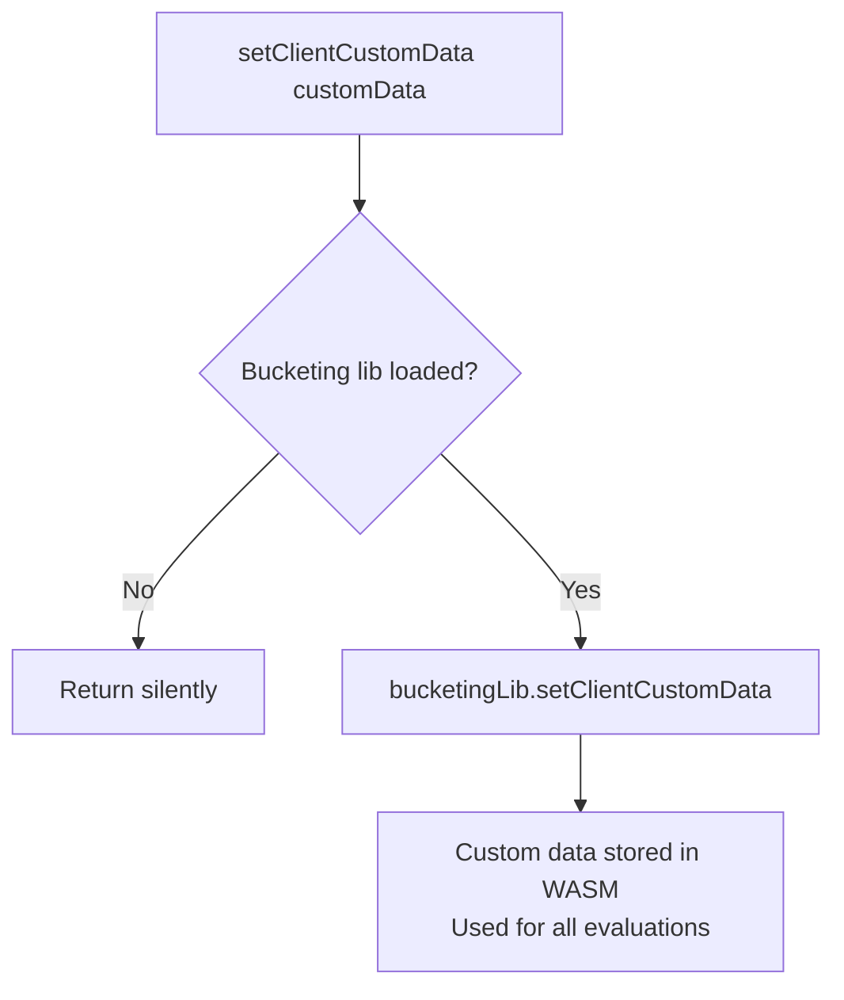

---

## Lifecycle

### `close()`

Close the SDK client. Flushes pending events, stops config polling, and cleans up resources. Should be called before process exit.

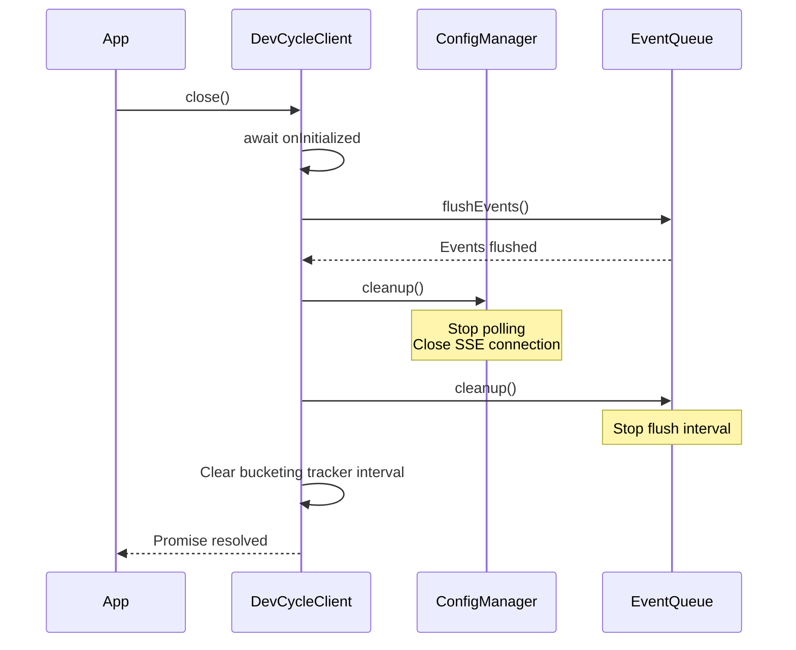

---

## Additional Notes

### Error Handling Summary

| Function | Consumer-Relevant Error Scenarios |
|----------|-----------------------------------|
| `initializeDevCycle` | Invalid SDK key throws `Error`. |
| `variable` | Returns default value if config not loaded or type mismatch (does not throw). |
| `allVariables` / `allFeatures` | Returns empty object if config not loaded (does not throw). |
| `track` | Logs warning if not initialized (does not throw). |
| `getClientBootstrapConfig` | Throws if `enableClientBootstrapping` option not set. |
