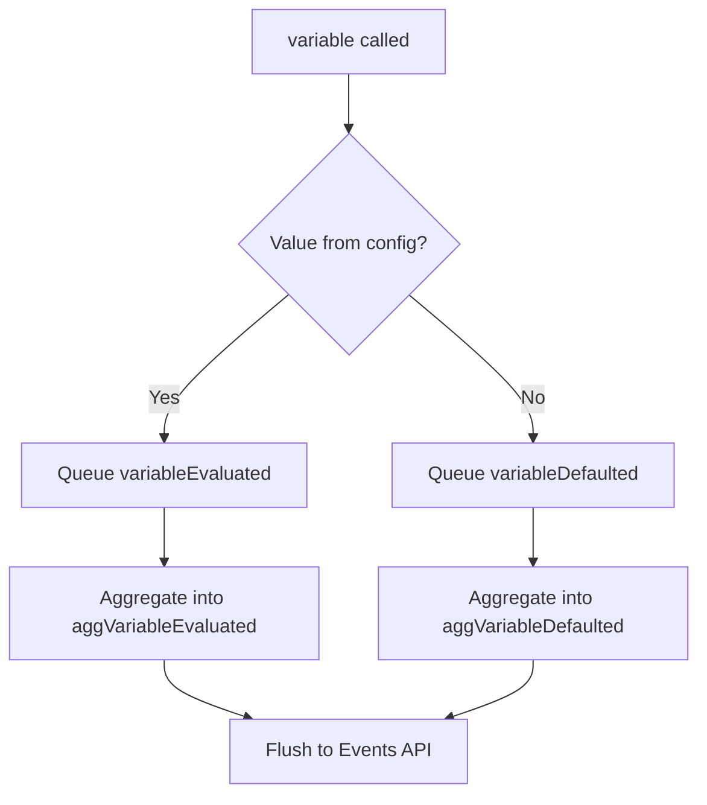
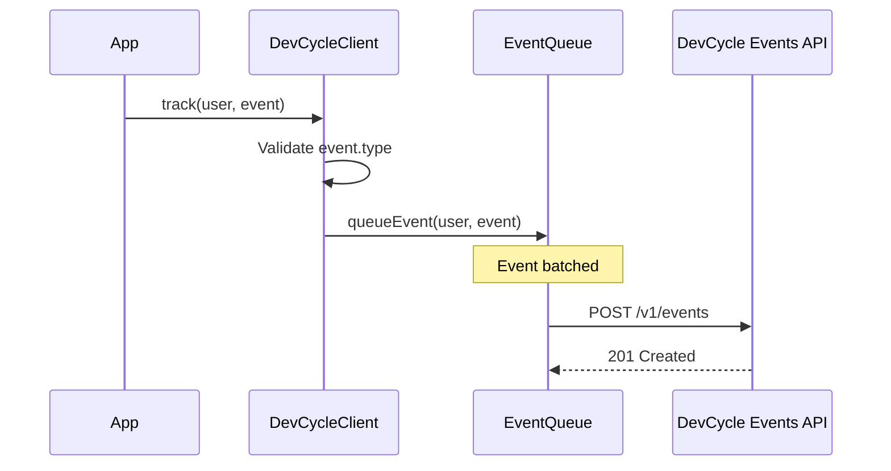

# DevCycle Node.js Server SDK - Events

This document describes all events used by the DevCycle Node.js Server SDK.

## Table of Contents

1. [Overview](#overview)
2. [Initialization Callback](#initialization-callback)
3. [Internal Analytics Events](#internal-analytics-events)
   - [Variable Evaluation Events](#variable-evaluation-events)
   - [SDK Config Events](#sdk-config-events)
   - [Custom Events](#custom-events)
4. [Event Types Definition](#event-types-definition)
5. [Comparison with Client SDK](#comparison-with-client-sdk)

---

## Overview

The Node.js Server SDK does **not** use an EventEmitter pattern for subscribable events like the client-side JS SDK. This is by design since the server SDK is stateless and request-based without persistent user connections.

Instead, the SDK provides:

1. **Callback-based initialization** - Notify when the client is ready
2. **Internal analytics events** - Automatically sent to DevCycle's Events API for tracking

---

## Initialization Callback

The SDK provides a callback/promise-based method to notify when initialization is complete:

```typescript
// Promise-based
await client.onClientInitialized()

// Callback-based
client.onClientInitialized((err?: Error) => {
    if (err) {
        console.error('Initialization failed:', err)
    } else {
        console.log('DevCycle is ready')
    }
})
```

**Source:** `src/client.ts:211-220`

---

## Internal Analytics Events

These events are generated internally and sent to DevCycle's Events API for analytics purposes. They are **not subscribable** by SDK consumers.

### Variable Evaluation Events

| Event Type | Trigger | Payload Fields |
|------------|---------|----------------|
| `variableEvaluated` | Variable evaluated with non-default value | `target` (key), `value` (count), `metaData`, `featureVars` |
| `aggVariableEvaluated` | Aggregated/batched version of above | Same as above |
| `variableDefaulted` | Variable returns default value | `target` (key), `metaData` with `evalReason` |
| `aggVariableDefaulted` | Aggregated/batched version of above | Same as above |

**Source:** `src/eventQueue.ts:12-17`



### SDK Config Events

| Event Type | Trigger | Payload Fields |
|------------|---------|----------------|
| `sdkConfig` | Config fetched from CDN | `target` (URL), `value` (responseTimeMS), `metaData` |

**Metadata fields:**
- `clientUUID` - Unique client identifier
- `reqEtag` - Request ETag header
- `reqLastModified` - Request Last-Modified header
- `resStatus` - Response HTTP status code
- `errMsg` - Error message (if failed)
- `sseConnected` - SSE connection status

**Source:** `src/client.ts:410-438`

### Custom Events

When consumers call `track()`, the event is transformed and queued:

```typescript
client.track(user, {
    type: 'purchase-completed',
    target: 'product-123',
    value: 49.99,
    metaData: { currency: 'USD' }
})
```

| Field | Description |
|-------|-------------|
| `type` | Becomes `customEvent` internally |
| `customType` | Original type provided by consumer |
| `target` | Event target identifier |
| `value` | Numeric value |
| `metaData` | Custom metadata object |
| `user_id` | User identifier |
| `featureVars` | Feature variables map |

**Source:** `src/client.ts:370-386`, `src/models/requestEvent.ts:29-32`



---

## Event Types Definition

```typescript
// src/eventQueue.ts:12-21
export const AggregateEventTypes: Record<string, string> = {
    variableEvaluated: 'variableEvaluated',
    aggVariableEvaluated: 'aggVariableEvaluated',
    variableDefaulted: 'variableDefaulted',
    aggVariableDefaulted: 'aggVariableDefaulted',
}

export const EventTypes: Record<string, string> = {
    ...AggregateEventTypes,
}
```

---

## Comparison with Client SDK

The browser-based JS Client SDK (`@devcycle/js-client-sdk`) uses an EventEmitter pattern with subscribable events. These events are **not available** in the Node.js Server SDK:

| Client SDK Event | Description | Available in Node.js SDK? |
|------------------|-------------|---------------------------|
| `initialized` | SDK initialization complete | No (use `onClientInitialized()`) |
| `error` | Error occurred | No |
| `configUpdated` | Configuration updated | No |
| `variableUpdated:*` | Variable value changed | No |
| `featureUpdated:*` | Feature changed | No |
| `variableEvaluated:*` | Variable evaluated | No |

The server SDK is designed for stateless request-based usage where each request evaluates flags independently, making event subscriptions unnecessary.
